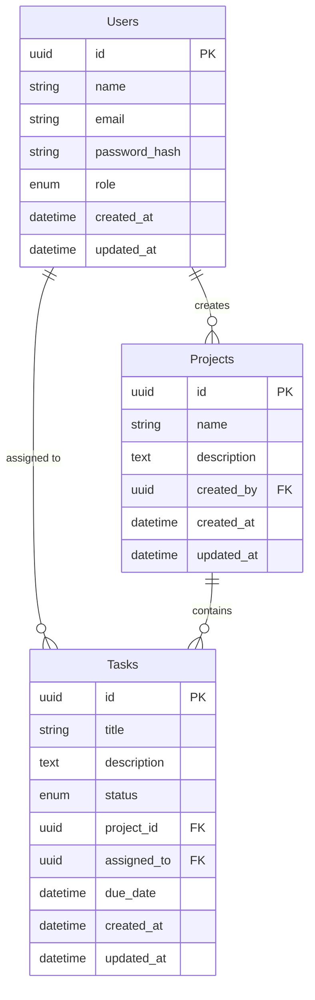

# Mini Project Management System Backend

A robust backend REST API for tracking projects, tasks, and users. Built following clean architecture principles with FastAPI, PostgreSQL and SQLAlchemy.

## Tech Stack
- **Python** 3.11+
- **FastAPI**
- **PostgreSQL**
- **SQLAlchemy (async)** + Alembic
- **Pydantic**
- **JWT Authentication**
- **Docker**
- **UV** (Dependency Management)

## Architecture Explanation

This API follows **Clean Architecture** patterns separating business rules from infrastructure:

- **`app/models/`**: Defines SQLAlchemy ORM models (Entity level)
- **`app/schemas/`**: Pydantic models for request validation and response serialization
- **`app/repositories/`**: Database abstraction logic (CRUD operations)
- **`app/services/`**: Core business logic and rules coordinating between repositories and endpoints
- **`app/api/`**: FastAPI routers representing the interface adapters
- **`app/core/`**: System configuration, dependency injection, and security
- **`app/db/`**: Database setup and engine instantiation

## ER Diagram


## Setup Instructions

### Using Docker (Recommended)
1. Clone the repository
2. Create standard environment variables: `cp .env.example .env`
3. Stand up the services:
   ```bash
   docker-compose up --build
   ```

### Local Setup (Using uv)
1. Install `uv` on your system.
2. Initialize and sync environment:
   ```bash
   uv sync
   uv pip install -e .[dev]
   ```
3. Run migrations:
   ```bash
   alembic revision --autogenerate -m "Initial configuration"
   alembic upgrade head
   ```
4. Start the app:
   ```bash
uv run uvicorn app.main:app --reload

or
   source .venv/bin/activate
uvicorn app.main:app --reload

   ```

## Using the API
- The interactive Swagger documentation is available at `http://localhost:8000/docs`. Wait, before invoking APIs you need to create an `admin` user through DB directly, or use a script? Let's use the `/auth/login` if there is a startup seeding, or create the first user as an admin directly in the database.

## Running Tests
Run pytest with async support:
```bash
pytest 
```
